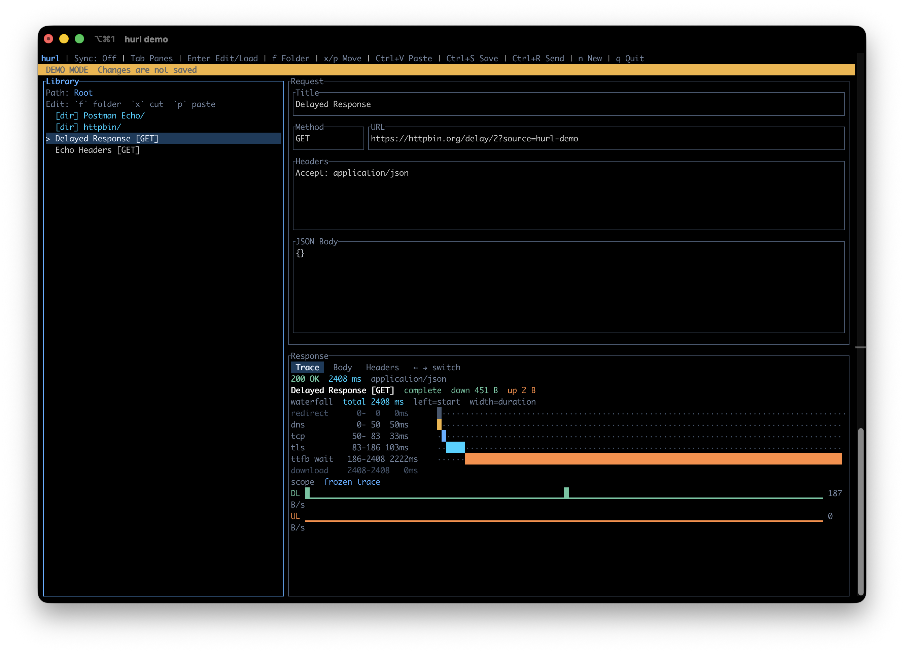

<h1 align="center">hurl</h1>

<p align="center">
  
</p>

<p align="center">
  <a href="https://github.com/robbiemccorkell/hurl/actions/workflows/on-push.yml">
    
  </a>
</p>

<p align="center"><strong><code>hurl</code> - [h]uman c[url]</strong></p>

`hurl` is a lightweight TUI for storing and triggering common API requests. It syncs your library via an encrypted private GitHub repo.

<p align="center">
  
</p>

## Getting Started

Install `hurl` using one of the methods below, then launch it from your terminal with:

```bash
hurl
```

Or explore the built-in demo mode:

```bash
hurl demo
```

For CLI help and metadata:

```bash
hurl --help
hurl --version
```

## Installation

Prebuilt binaries are intended to be published through GitHub Releases, installer scripts, and Homebrew.

### Homebrew

```bash
brew install robbiemccorkell/tap/hurl
```

### macOS and Linux

```bash
curl --proto '=https' --tlsv1.2 -LsSf https://github.com/robbiemccorkell/hurl/releases/latest/download/hurl-installer.sh | sh
```

### Windows PowerShell

```powershell
powershell -ExecutionPolicy Bypass -c "irm https://github.com/robbiemccorkell/hurl/releases/latest/download/hurl-installer.ps1 | iex"
```

### Manual Download

You can also download the appropriate archive for your platform from the GitHub Releases page.

## Updating

### Homebrew

```bash
brew upgrade hurl
```

### Shell / PowerShell Installer

If your installed copy supports in-place updates, run:

```bash
hurl update
```

The release installers also install a standalone updater command:

```bash
hurl-update
```

### Help and Version

```bash
hurl help
hurl help update
hurl version
```

### Demo Mode

```bash
hurl demo
```

This launches an isolated demo library backed by public test APIs.
Changes made in demo mode only last for the current session, and GitHub sync is disabled.

## Features

- Create requests with an optional title, HTTP method, URL, headers, and JSON request body
- Save requests into a local library
- Browse saved requests and folders in the library pane
- Create folders and move saved items between folders
- Load and submit saved requests
- Launch an isolated demo mode with a built-in sample library and public test APIs
- View status code, response time, response headers, and response body
- Optionally sync the saved request library through a user-owned private GitHub repo with client-side encryption

## Sync

`hurl` can sync its saved request library between machines using:

- a user-owned private GitHub repository
- GitHub sign-in through device flow
- a user-supplied sync password for client-side encryption

The sync feature is managed from the full-screen `Settings` page.

### How Sync Works

1. Press `g` to open `Settings`.
2. Select `Connect GitHub` and complete the GitHub device-flow sign-in in your browser.
3. Choose the GitHub repo owner and repo name.
4. Enter a sync password and confirm it.
5. Select `Enable Sync`.

After sync is enabled:

- `hurl` runs a best-effort sync on startup
- `hurl` syncs after successful saves
- you can run a manual sync from `Settings`

### Security Model

- Request data is encrypted locally before upload.
- The remote GitHub repo stores a plaintext `manifest.json` plus encrypted request files.
- Titles, URLs, headers, and request bodies are not stored in plaintext in the sync repo.
- The sync password is stored locally in the OS keychain when available.

### Merge Behavior

When two machines sync against the same repo:

- local-only requests are uploaded
- remote-only requests are imported
- if the same request changed differently on both machines, `hurl` keeps the local version and creates a `CONFLICT ...` copy for the remote version

Synced deletions are not implemented yet.

## Tech Stack

- [`ratatui`](https://github.com/ratatui/ratatui) for layout and rendering
- [`crossterm`](https://github.com/crossterm-rs/crossterm) for terminal input/output
- [`tui-textarea`](https://github.com/rhysd/tui-textarea) for request editing
- [`reqwest`](https://github.com/seanmonstar/reqwest) + `tokio` for async HTTP
- `serde` / `serde_json` for persistence and JSON formatting

## Layout

The interface is split into three main panes:

```text
+----------------------+---------------------------------------------+
| Library              | Request                                     |
| folders / requests   | title / method / url / headers / JSON body |
+----------------------+---------------------------------------------+
| Response                                                           |
| status / time / headers / body                                     |
+--------------------------------------------------------------------+
```

## How To Use

### CLI

- Run `hurl` with no arguments to launch the TUI.
- Run `hurl demo` to launch an isolated demo library backed by public test APIs.
- Run `hurl --help` or `hurl help` to see available commands.
- Run `hurl --version` or `hurl version` to print the version.
- Run `hurl update` to update an installer-managed copy when supported.

### Create a Request

1. Launch the app with `hurl`.
2. Press `n` to create a new draft.
3. Use `Up` / `Down` in the request pane to move between fields.
4. Press `Enter` to edit the selected field.
5. Press `Esc` to leave edit mode.
6. Press `Ctrl+S` to save the request to the library.

If you are currently inside a folder in the `Library` pane, the new request is saved into that folder.

### Submit a Saved Request

1. Press `Esc` if you are currently editing.
2. Press `Tab` until focus is on `Library`.
3. Use `Up` / `Down` to highlight a saved request or folder.
4. Press `Enter` on a folder to open it, or `Enter` on a saved request to load it into the editor.
5. Press `Left` or `Backspace` to move back to the parent folder.
6. Press `Ctrl+R` to send the loaded request.

The response appears in the bottom-right `Response` pane.

### Organize Requests into Folders

1. Press `Tab` until focus is on `Library`.
2. Press `f` to create a folder in the current library location.
3. Use `Enter` to open folders and `Left` or `Backspace` to move back up.
4. Highlight an existing request or folder and press `x` to cut it.
5. Navigate to the destination folder and press `p` to paste it there.

### Configure Sync

1. Press `g` to open `Settings`.
2. Press `Tab` to move between the settings navigation and the settings detail pane.
3. Use `Up` / `Down` to move through the sync actions and fields.
4. Press `Enter` to activate an action or edit a selected text field.
5. Press `Esc` to leave settings edit mode, then `Esc` again to close `Settings`.

### Quit the App

1. Press `Esc` if you are editing a field.
2. Press `q`.

## Keybindings

| Key | Action |
| --- | --- |
| `Tab` / `Shift+Tab` | Cycle focus between panes |
| `Up` / `Down` | Move through library items, request fields, or response scroll |
| `Left` / `Right` | Move between adjacent request fields, navigate up from a folder, or switch response tabs where applicable |
| `Backspace` | Move to the parent folder in the library pane |
| `Enter` | Open a folder, load a request, or enter edit mode for the selected request field |
| `Esc` | Leave edit mode, or close `Settings` when not editing |
| `n` | Create a new request draft |
| `f` | Create a folder in the current library location |
| `x` | Cut the selected library item for moving |
| `p` | Paste the cut library item into the current folder |
| `g` | Open or close `Settings` |
| `Ctrl+V` | Paste from clipboard into the active request text field |
| `Ctrl+S` | Save the current request |
| `Ctrl+R` | Send the current request |
| `q` | Quit |

## Where Requests Are Stored

Saved requests are persisted as a JSON file in the OS-appropriate config directory using the `directories` crate.

Examples:

- macOS: under `~/Library/Application Support/...` or `~/Library/Preferences/...` depending on platform conventions
- Linux: under `~/.config/...`
- Windows: under `%APPDATA%\\...`

The main local library file is `library.json`.

If sync is enabled, `hurl` also stores local sync metadata in `sync.json`.

## Development

If you want to run `hurl` from source:

```bash
cargo run
```

To test the sync feature from source, add your GitHub OAuth app's device-flow client ID to `src/config.rs`.

To run the test suite:

```bash
cargo test
```

## License

MIT. See [LICENSE](/home/robbiemccorkell/Developer/robbiemccorkell/hurl/LICENSE).
